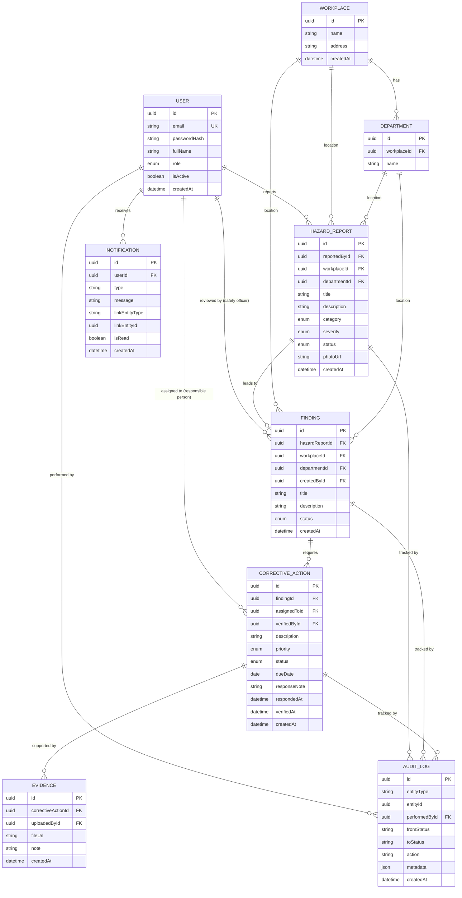

# Database Design

## Occupational Safety and Health Safety Management System (OSH-SMS)

Status: Draft v1 — describes the MVP schema only (see PRODUCT_REQUIREMENTS.md
Section 5.2 for deferred modules, whose tables are sketched at the end of
this document but not built in v1).
Last updated: 2026-08-17

---

## 1. Conventions

- Primary keys: `id` UUID (via `gen_random_uuid()` / Prisma `cuid()` —
  pick one and use consistently; UUID recommended for portability).
- All tables: `createdAt`, `updatedAt` timestamps.
- Soft delete is **not** used in v1 except where noted — safety records
  are audit-sensitive; instead of deleting, records are closed/archived.
  Users can be deactivated (`isActive` flag) rather than deleted.
- Enums are modeled as Postgres enums via Prisma `enum`.
- Money/severity scores are out of scope for MVP (risk scoring arrives
  with the Risk Assessments module, post-MVP).

## 2. Entity-Relationship Diagram (MVP scope)



## 3. Table Details (MVP)

### 3.1 `User`
| Field | Type | Notes |
|---|---|---|
| id | uuid PK | |
| email | string, unique | login identifier |
| passwordHash | string | bcrypt/argon2 |
| fullName | string | |
| role | enum `Role` | `ADMIN`, `SAFETY_OFFICER`, `RESPONSIBLE_PERSON`, `VIEWER`, `EMPLOYEE` |
| isActive | boolean, default true | deactivate instead of delete |
| createdAt / updatedAt | datetime | |

Note: "Reporter" is not a separate role — any authenticated user
(typically `EMPLOYEE`) can submit a hazard report.

### 3.2 `Workplace`
| Field | Type | Notes |
|---|---|---|
| id | uuid PK | |
| name | string | e.g. "Main Plant" |
| address | string, nullable | |
| createdAt / updatedAt | datetime | |

### 3.3 `Department`
| Field | Type | Notes |
|---|---|---|
| id | uuid PK | |
| workplaceId | uuid FK -> Workplace | |
| name | string | e.g. "Warehouse", "Maintenance" |

### 3.4 `HazardReport`
| Field | Type | Notes |
|---|---|---|
| id | uuid PK | |
| reportedById | uuid FK -> User | |
| workplaceId | uuid FK -> Workplace | |
| departmentId | uuid FK -> Department, nullable | |
| title | string | |
| description | text | |
| category | enum `HazardCategory` | e.g. `ELECTRICAL`, `CHEMICAL`, `ERGONOMIC`, `FIRE`, `MECHANICAL`, `OTHER` |
| severity | enum `Severity` | `LOW`, `MEDIUM`, `HIGH`, `CRITICAL` (reporter's estimate) |
| status | enum `HazardReportStatus` | `SUBMITTED`, `UNDER_REVIEW`, `ACCEPTED`, `REJECTED`, `CLOSED` |
| photoUrl | string, nullable | single photo in MVP |
| createdAt / updatedAt | datetime | |

### 3.5 `Finding`
| Field | Type | Notes |
|---|---|---|
| id | uuid PK | |
| hazardReportId | uuid FK -> HazardReport, nullable | null when finding originates from a manual/inspection entry rather than a hazard report |
| workplaceId | uuid FK -> Workplace | |
| departmentId | uuid FK -> Department, nullable | |
| createdById | uuid FK -> User | the safety officer who created it |
| title | string | |
| description | text | |
| status | enum `FindingStatus` | `OPEN`, `IN_PROGRESS`, `CLOSED` |
| createdAt / updatedAt | datetime | |

Business rule: a `Finding` can only move to `CLOSED` when **all** of its
`CorrectiveAction` records are `VERIFIED`. Enforced in the service layer,
not the database.

### 3.6 `CorrectiveAction`
| Field | Type | Notes |
|---|---|---|
| id | uuid PK | |
| findingId | uuid FK -> Finding | |
| assignedToId | uuid FK -> User | the responsible person |
| verifiedById | uuid FK -> User, nullable | safety officer who verified |
| description | text | what needs to be done |
| priority | enum `Priority` | `LOW`, `MEDIUM`, `HIGH`, `URGENT` |
| status | enum `CorrectiveActionStatus` | `ASSIGNED`, `IN_PROGRESS`, `RESPONDED`, `EVIDENCE_SUBMITTED`, `VERIFIED`, `REJECTED` |
| dueDate | date, nullable | |
| responseNote | text, nullable | responsible person's response |
| respondedAt | datetime, nullable | |
| verifiedAt | datetime, nullable | |
| createdAt / updatedAt | datetime | |

State machine:
```
ASSIGNED -> IN_PROGRESS -> RESPONDED -> EVIDENCE_SUBMITTED -> VERIFIED
                                              ^                   |
                                              |___ REJECTED <_____|
                                          (safety officer rejects evidence,
                                           sends back for more evidence)
```

### 3.7 `Evidence`
| Field | Type | Notes |
|---|---|---|
| id | uuid PK | |
| correctiveActionId | uuid FK -> CorrectiveAction | |
| uploadedById | uuid FK -> User | |
| fileUrl | string | photo/document path |
| note | text, nullable | |
| createdAt | datetime | |

A corrective action can have multiple evidence uploads (e.g. before/after
photos), which is why this is its own table rather than a field on
`CorrectiveAction`.

### 3.8 `AuditLog`
| Field | Type | Notes |
|---|---|---|
| id | uuid PK | |
| entityType | string | `"HazardReport"`, `"Finding"`, `"CorrectiveAction"`, etc. |
| entityId | uuid | polymorphic reference (no FK constraint — intentional, see below) |
| performedById | uuid FK -> User | |
| fromStatus | string, nullable | |
| toStatus | string, nullable | |
| action | string | e.g. `"REVIEWED"`, `"VERIFIED"`, `"EVIDENCE_UPLOADED"` |
| metadata | json, nullable | free-form extra context |
| createdAt | datetime | |

`entityType` + `entityId` is a polymorphic reference on purpose: the
audit log must outlive and stay decoupled from any single entity table,
and must never block or be blocked by deletes/changes on the entities it
describes. Application code, not a DB constraint, guarantees `entityId`
points at a real record.

### 3.9 `Notification`
| Field | Type | Notes |
|---|---|---|
| id | uuid PK | |
| userId | uuid FK -> User | recipient |
| type | string | e.g. `"CORRECTIVE_ACTION_ASSIGNED"` |
| message | string | |
| linkEntityType | string, nullable | for deep-linking in the UI |
| linkEntityId | uuid, nullable | |
| isRead | boolean, default false | |
| createdAt | datetime | |

## 4. Key Business Rules Enforced at the Service Layer

1. A `HazardReport` cannot skip from `SUBMITTED` directly to `CLOSED`.
2. A `Finding` cannot be `CLOSED` while any linked `CorrectiveAction` is
   not `VERIFIED`.
3. A `CorrectiveAction` cannot move to `VERIFIED` without at least one
   `Evidence` record.
4. Every status transition on `HazardReport`, `Finding`, and
   `CorrectiveAction` writes exactly one `AuditLog` row in the same
   transaction as the state change.
5. Only `SAFETY_OFFICER`/`ADMIN` roles can review hazard reports, create
   findings, or verify corrective actions. Only the assigned
   `RESPONSIBLE_PERSON` (or `ADMIN`) can respond/upload evidence for a
   given corrective action.

## 5. Deferred Schema (Post-MVP, Sketch Only — Not Built in v1)

These are noted so the MVP schema doesn't accidentally paint the project
into a corner, but they are **not** implemented until their module phase
(see IMPLEMENTATION_PLAN.md).

- **`Inspection`** / **`InspectionTemplate`** / **`InspectionChecklistItem`**
  — scheduled inspections with reusable checklist templates; a
  `Finding.inspectionId` FK would be added at that time (alongside the
  existing `hazardReportId`, since a finding may originate from either).
- **`RiskAssessment`** / **`RiskAssessmentItem`** — likelihood x severity
  matrix scoring, linked to a `Workplace`/`Department` and optionally a
  `Finding`.
- Notification delivery channels table (email/SMS provider metadata) if
  notifications grow beyond in-app.

## 6. Migration Approach

- Prisma migrations (`prisma migrate dev` in development, `prisma migrate
  deploy` in production), committed to `backend/prisma/migrations/`.
- Seed script (`backend/prisma/seed.ts`) for local dev: one workplace,
  two departments, one user per role — enough to exercise the full
  workflow without manual setup.
